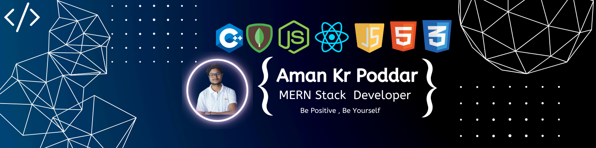

<!-- ----------- HEAD SECTION ------------ -->

  

<h3 align="center">An enthusiastic student pursuing B.Tech degree in Computer Science & Engineering and always excited about learning new technologies.</h3>

- 🔭 I’m currently working **as a MERN Stack Developer.**

- 🌱 I’m currently learning **C++ , DSA**

- 👯 I’m looking to collaborate on **Web Development projects.**

- 💬 Ask me about **anything as I am passionate about technology.**

- 📫 How to reach me **: Reach me through LinkedIn https://www.linkedin.com/in/amanpoddar10/**

- ⚡ Fun fact **: I love to travel.**

 

<!-- ----------- HEAD SECTION END ------------ -->

<!-- ----------- TECH STACK SECTION ------------ -->

              

<!-- ----------- TECH STACK SECTION END------------ -->

<!-- ----------- GITHUB STATS SECTION ------------ -->

&nbsp;

<!-- ----------- GITHUB STATS SECTION END ------------ -->

<!-- ----------- CONNECT WITH ME SECTION ------------ -->

  
 
 

   
 

<!-- ----------- CONNECT WITH ME SECTION END ------------ -->

[twitter]: https://mobile.twitter.com/aman_sah1
[instagram]: https://www.instagram.com/aman_sah_1016/
[linkedin]: https://www.linkedin.com/in/amanpoddar10/
[github]:https://github.com/Am10aN16
[gmail]:mailto:poddaraman1016@gmail.com
